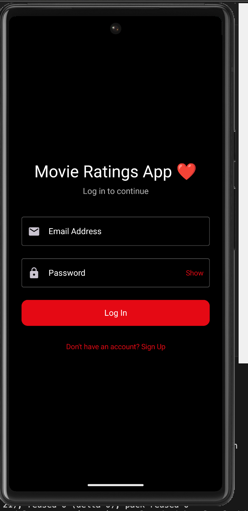
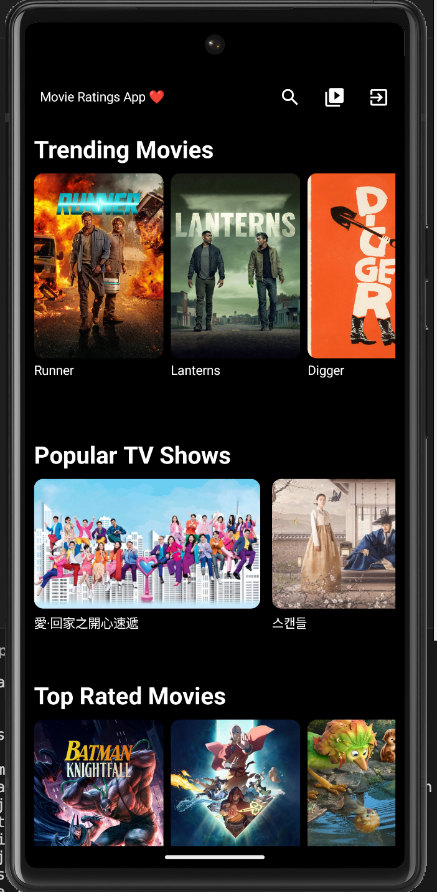
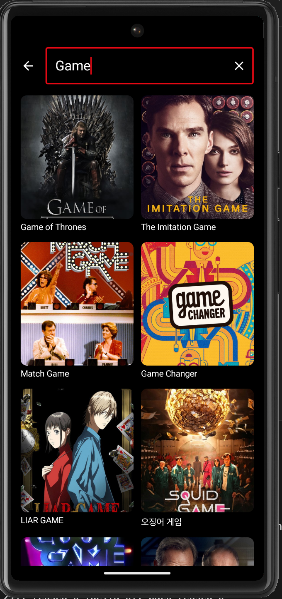
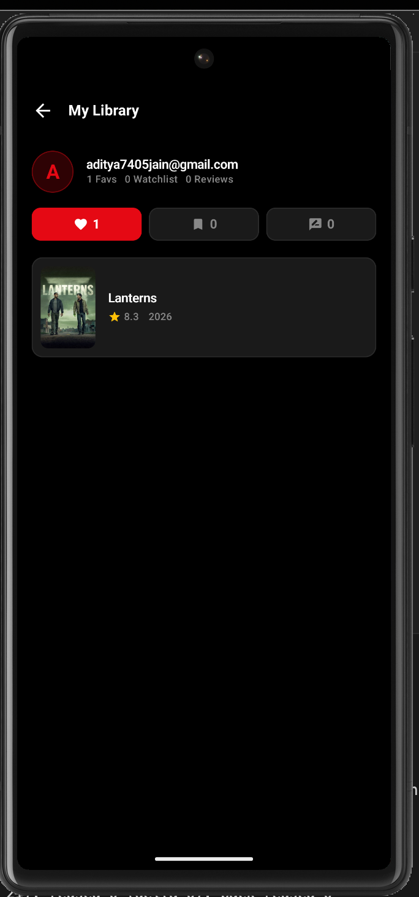
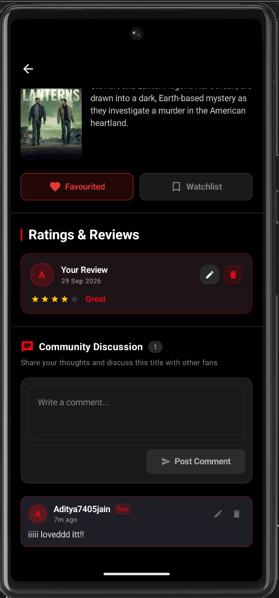

# 🎬 Movie Ratings & Community Discussion App

[](https://kotlinlang.org)
[](https://developer.android.com)
[](https://developer.android.com/jetpack/compose)
[](https://m3.material.io)
[](https://firebase.google.com)
[](https://square.github.io/retrofit/)
[](https://www.themoviedb.org/documentation/api)

A state-of-the-art, modern Android movie discovery and discussion application built natively with **Kotlin**, **Jetpack Compose (Material 3)**, and **Firebase**. The app features real-time movie & TV metadata powered by **The Movie Database (TMDb) API**, persistent user authentication, personal ratings & reviews, favourites, watchlist, and live movie-specific community discussion boards.

---

## 📸 App Showcase

| 🔐 Authentication | 🏠 Home Discovery | 🔍 Search Feature |
| :---: | :---: | :---: |
|  |  |  |

| 📌 Library & Watchlist | 💬 Community Discussion |
| :---: | :---: |
|  |  |

---

## 🌟 Key Features

### 1. 🎬 TMDb Movie & TV Browsing
- **Trending Movies**: Real-time trending cinema updated daily.
- **Popular TV Shows**: Browse hit television series.
- **Top Rated Movies**: Discover all-time cinematic masterpieces.
- **Rich Media Carousels**: Smooth horizontal scrolling carousels with backdrop and poster art.

### 2. 🔍 Real-Time Search
- **Instant Search**: Search through thousands of movies and television shows.
- **Debounced Input**: Optimized network queries to respect TMDb rate limits.
- **Detailed Results**: View ratings, release dates, and high-resolution posters.

### 3. 🔐 Firebase Authentication
- **Secure Email & Password**: Registration and sign-in managed via Firebase Auth.
- **Form Validation**: Real-time validation for email formats, passwords, and matching fields.
- **Persistent Sessions**: State-driven automatic navigation based on authentication status.

### 4. ⭐ User Ratings & Reviews
- **1–5 Star Rating System**: Interactive rating widget with descriptive indicators (Poor, Fair, Good, Great, Excellent).
- **Written Reviews**: Authenticated users can write in-depth reviews.
- **Edit & Delete**: Full lifecycle management of personal reviews without duplicate entries.
- **Distinct Metrics**: Clear visual separation between TMDb public scores and user community ratings.

### 5. ❤️ Favourites & 📌 Watchlist
- **One-Tap Toggling**: Instant optimistic updates with animated icon feedback.
- **Cloud Synchronization**: User-scoped Firestore storage (`users/{userId}/favourites` and `users/{userId}/watchlist`).
- **Offline Resilience**: Real-time snapshot listeners keep local cache in sync.

### 6. 👤 User Library & Profile
- **Personal Dashboard**: Dedicated library view displaying user avatar, email, and statistics.
- **Categorized Tabs**: Seamless navigation between **Favourites**, **Watchlist**, and **My Reviews**.
- **Direct Navigation**: Tap any saved item to launch the full details view with preserved metadata.

### 7. 💬 Movie-Specific Community Discussion
- **Public Discussion Boards**: Dedicated comment stream for every single movie.
- **Real-Time Feed**: Chat-style comment stream with timestamp labels (*Just now*, *5m ago*, etc.).
- **Author Ownership**: Users can edit and delete only their own comments.
- **Visual Badges**: Author badges (`You`) and `(edited)` indicators.

---

## 🏗️ Architecture & Design Patterns

The project is built adhering to **Google's Recommended Modern Android Architecture** guidelines using the **MVVM (Model-View-ViewModel)** pattern with **Unidirectional Data Flow (UDF)**.

```
┌────────────────────────────────────────────────────────┐
│                   UI Layer (Compose)                   │
│  HomeScreen │ SearchScreen │ DetailsScreen │ Library   │
└───────────────────────────▲────────────────────────────┘
                            │ StateFlow Events & UIState
┌───────────────────────────┴────────────────────────────┐
│                    ViewModel Layer                     │
│  HomeViewModel │ SearchViewModel │ ReviewViewModel    │
│  UserLibraryViewModel │ DiscussionViewModel            │
└───────────────────────────▲────────────────────────────┘
                            │ Coroutines & Flows
┌───────────────────────────┴────────────────────────────┐
│                   Repository Layer                     │
│  MovieRepository │ UserLibraryRepository               │
│  ReviewRepository │ DiscussionRepository │ AuthRepo    │
└─────────────▲────────────────────────────▲─────────────┘
              │ Retrofit                    │ Firebase SDK
┌─────────────┴─────────────┐  ┌───────────┴─────────────┐
│      TMDb Remote API      │  │   Firebase Auth / Cloud │
│ (The Movie Database v3)   │  │   Firestore Database    │
└───────────────────────────┘  └─────────────────────────┘
```

### Architectural Principles:
- **Clean Separation of Concerns**: UI components (`Screen`, `Component`) never interact with network or database layers directly.
- **Single Source of Truth**: Repositories abstract the origin of data (Firestore vs TMDb API).
- **Reactive State Management**: ViewModels expose immutable `StateFlow`s collected as Compose states.
- **Optimistic UI Updates**: State changes for favourites and watchlist update instantly for a responsive feel while background sync completes.

---

## 🛠️ Technology Stack

| Component | Technology | Description |
| :--- | :--- | :--- |
| **Language** | Kotlin 2.0+ | Modern expressive language with Coroutines & StateFlow |
| **UI Framework** | Jetpack Compose | Modern declarative UI toolkit |
| **Design System** | Material 3 (Material You) | Sleek dark mode design palette with custom vector icons |
| **Image Loading** | Coil Compose | Asynchronous image loading with memory and disk caching |
| **Networking** | Retrofit 2 & OkHttp 4 | REST client with interceptors and connection pooling |
| **JSON Serialization** | Kotlinx Serialization | Type-safe Kotlin JSON parser |
| **Authentication** | Firebase Auth | Secure user identity management |
| **Database** | Cloud Firestore | Real-time NoSQL cloud database |
| **Navigation** | Navigation Compose | Type-safe single-activity navigation graph |
| **Build System** | Gradle (Kotlin DSL) | Modern build automation system |

---

## 📁 Project Structure

```
com.example.movieratings/
├── MainActivity.kt                  # Single Activity entry point
├── MovieApp.kt                      # Top-level composable
├── data/
│   ├── model/                       # Data models
│   │   ├── MediaItem.kt             # TMDb Movie/TV models & API responses
│   │   ├── Review.kt                # User rating & review entity
│   │   ├── DiscussionComment.kt     # Community discussion comment entity
│   │   └── UiState.kt               # Generic UI state wrappers (Loading, Success, Error)
│   ├── remote/                      # Networking
│   │   ├── TmdbApi.kt               # Retrofit endpoint definitions
│   │   └── RetrofitClient.kt        # Retrofit & OkHttp singleton instance
│   └── repository/                  # Repositories (Data Sources)
│       ├── AuthRepository.kt        # Firebase Authentication management
│       ├── MovieRepository.kt       # TMDb API interactions
│       ├── ReviewRepository.kt      # Firestore movie reviews
│       ├── UserLibraryRepository.kt # Favourites & Watchlist management
│       └── DiscussionRepository.kt  # Public movie discussions
├── viewmodel/                       # ViewModels (Business Logic)
│   ├── AuthViewModel.kt
│   ├── HomeViewModel.kt
│   ├── SearchViewModel.kt
│   ├── ReviewViewModel.kt
│   ├── UserLibraryViewModel.kt
│   └── DiscussionViewModel.kt
├── navigation/
│   └── NavGraph.kt                  # Compose Navigation graph & route definitions
├── ui/
│   ├── components/                  # Reusable UI components
│   │   ├── MovieCard.kt
│   │   ├── TvCard.kt
│   │   ├── MovieCarousel.kt
│   │   ├── SectionHeader.kt
│   │   ├── LoadingView.kt
│   │   └── ErrorView.kt
│   ├── screens/                     # Full-screen Composables
│   │   ├── LoginScreen.kt
│   │   ├── SignupScreen.kt
│   │   ├── HomeScreen.kt
│   │   ├── SearchScreen.kt
│   │   ├── DetailsScreen.kt
│   │   └── LibraryScreen.kt
│   └── theme/                       # Design tokens & themes
│       ├── Color.kt
│       ├── Theme.kt
│       ├── Type.kt
│       └── AppIcons.kt              # Native vector icon definitions
```

---

## 🗄️ Database Structure (Cloud Firestore)

```
Firestore Root
├── reviews/
│   └── {movieId}/
│       └── userReviews/
│           └── {userId}             # One rating & review per user per movie
│                 ├── userId: String
│                 ├── userEmail: String
│                 ├── movieId: Int
│                 ├── rating: Int (1..5)
│                 ├── reviewText: String
│                 ├── createdAt: Long
│                 └── updatedAt: Long
│
├── discussions/
│   └── {movieId}/
│       └── comments/
│           └── {commentId}          # Multiple discussion comments per movie
│                 ├── userId: String
│                 ├── userEmail: String
│                 ├── userName: String
│                 ├── text: String
│                 ├── createdAt: Long
│                 └── updatedAt: Long
│
└── users/
    └── {userId}/
        ├── favourites/
        │   └── {movieId}            # User's saved favourite movies
        ├── watchlist/
        │   └── {movieId}            # User's saved watchlist movies
        └── reviews/
            └── {movieId}            # Mirrored reviews for personal library
```

---

## 🛡️ Firestore Security Rules

The application uses fine-grained Firestore security rules defined in [`firestore.rules`](firestore.rules):

```javascript
rules_version = '2';

service cloud.firestore {
  match /databases/{database}/documents {

    // ── Public Movie Discussions / Comments ──────────────────────────────────
    // - Anyone can read discussion threads.
    // - Authenticated users can create comments.
    // - Users can edit or delete ONLY their own comments.
    match /discussions/{movieId}/comments/{commentId} {
      allow read: if true;
      allow create: if request.auth != null && request.resource.data.userId == request.auth.uid;
      allow update, delete: if request.auth != null && resource.data.userId == request.auth.uid;
    }

    // ── Ratings & Reviews ───────────────────────────────────────────────────
    // - Anyone can read movie reviews.
    // - Authenticated users can write, update, or delete only their own review.
    match /reviews/{movieId}/userReviews/{userId} {
      allow read: if true;
      allow write: if request.auth != null && request.auth.uid == userId;
    }

    // ── User Library (Favourites, Watchlist, Mirrored Reviews) ───────────────
    // - Only the authenticated owner can access their personal lists.
    match /users/{userId}/{document=**} {
      allow read, write: if request.auth != null && request.auth.uid == userId;
    }
  }
}
```

---

## 🚀 Getting Started

### Prerequisites
- **Android Studio**: Jellyfish (2023.3.1) / Koala / Ladybug or newer.
- **JDK**: Version 17+.
- **Android SDK**: Compile SDK 34, Min SDK 24.
- **TMDb API Key**: Sign up at [themoviedb.org](https://www.themoviedb.org) to obtain an API key.
- **Firebase Project**: A Firebase project with **Authentication (Email/Password)** and **Cloud Firestore** enabled.

---

### Setup Instructions

1. **Clone the repository**:
   ```bash
   git clone https://github.com/ADITYA8405/Moviesreviewapp.git
   cd Moviesreviewapp
   ```

2. **Configure TMDb API Key**:
   Add your TMDb API key to `local.properties` in the project root:
   ```properties
   TMDB_API_KEY=your_tmdb_api_key_here
   ```

3. **Configure Firebase**:
   - Download `google-services.json` from your Firebase Console.
   - Place `google-services.json` into the `app/` directory (`app/google-services.json`).

4. **Build and Run**:
   ```bash
   # Build the debug APK
   ./gradlew assembleDebug

   # Run unit tests
   ./gradlew testDebugUnitTest

   # Install and run on connected device or emulator
   ./gradlew installDebug
   ```

---

## 📄 License

This project is licensed under the MIT License - see the [LICENSE](LICENSE) file for details.

---

## 🙏 Acknowledgements

- [The Movie Database (TMDb)](https://www.themoviedb.org/) for providing the rich movie & TV API.
- [Google Android Team](https://developer.android.com/jetpack/compose) for Jetpack Compose and Material 3.
- [Firebase](https://firebase.google.com/) for authentication and real-time cloud data infrastructure.
